# Proj 2 (Anish Vankayalapati)

## Part 1: Fun with Filters
### 1.1: Finite Difference Operator 

I used the given values for *Dx* and *Dy* to calculate the respective partial derivatives in x and y by convolving with
the given cameraman image. Then I combined the derivatives by computing their magnitude to form the gradient magnitude image.

#### dy
 
#### dx 
 
#### gradient magnitude image

#### binarized gradient magnitude image
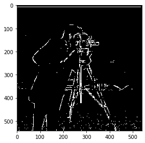

### 1.2: Derivative of Gaussian (DoG) filter

Using a size of 31 and sigma of 5, I made a Gaussian filter to blur the image and then repeated the procedure from **1.1**. Since blurring
the image smoothens out the image, the result is a lot smoother and cleaner than previously but due to the blurring, the outline is much thicker than in
the previous result.

#### dy
 
#### dx 
 
#### gradient magnitude image
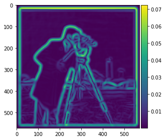
#### binarized gradient magnitude image
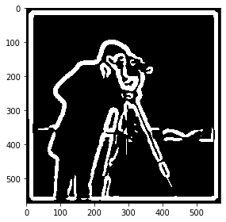

### 1.3: Image Straightening

The 1st image I used was the facade image.
#### Original Image
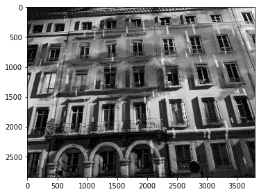

The best rotation angle was determined to be **-4 degrees**.
#### Straightened Image
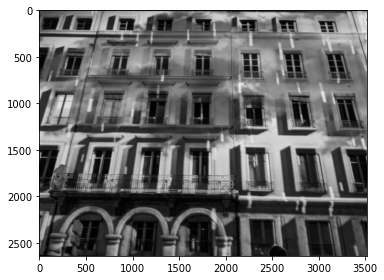
#### Angle Histogram (angles in radians)
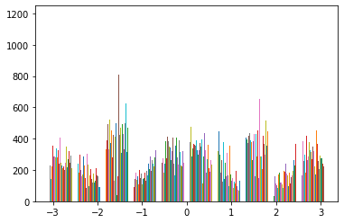

2nd image I used is of a cat slanting on a sofa (**Failure Case**).
`
#### Original Image
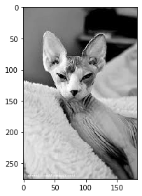

The best rotation angle was determined to be **8 degrees**.
#### Straightened Image

#### Angle Histogram (angles in radians)
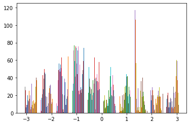

This image didn't work very well since the algorithm thinks the cat should be slanted further in the wrong direction. This may be
due to the cropped nature of the image, where the cat takes up most of the photo. This would make it difficult for the algorithm to detect
where the edges are.

3rd image I used is of Leaning Tower of Pisa
`
#### Original Image
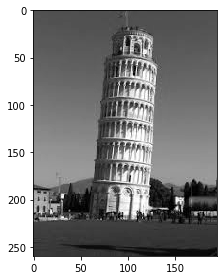

The best rotation angle was determined to be **5 degrees**.
#### Straightened Image
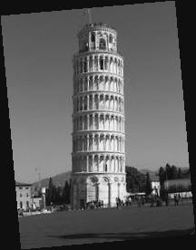

#### Angle Histogram (angles in radians)

4th image I used is of a tilted building on a street
`
#### Original Image

The best rotation angle was determined to be **-5 degrees**.
#### Straightened Image
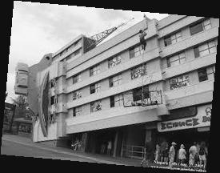

#### Angle Histogram (angles in radians)

## Part 2: Fun with Frequencies!
### 2.1: Image Sharpening 

1st image I used was the Taj Mahal image given as an example. 
#### Original Image

#### Sharpened Image

In the above image, the black inscriptions in the center, as well as the renovation structure on the left, are significantly sharper. 

2nd image I used was of an image of a black swan I took in Spain.

#### Original Image

#### Sharpened Image

Since the image is already pretty high quality, the sharpening isn't very evident. However, the curve around its neck as well as its beak have been somewhat sharpened further due to this algorithm.

Using this sharpened image, I blurred it and sharpened it again to compare it with the original sharpened image.

#### Blurred then sharpened image

Here, the head of the swan is blurrier in the final image than the initial sharp image. Since the sharpening effect doesn't actually add new information to
the image, but rather accentuates existing features, blurring and then sharpening it serves to reduce the sharpening effect.

### 2.2: Hybrid Images

I started by using the sample images of Derek and his cat, Nutmeg

#### Derek

#### Nutmeg

I aligned both of the images based on nutmeg and then created the hybrid image using low-pass with `cutoff=4` for Derek and high-pass with `cutoff=7`
for nutmeg.

#### Hybrid Derek-Nutmeg image
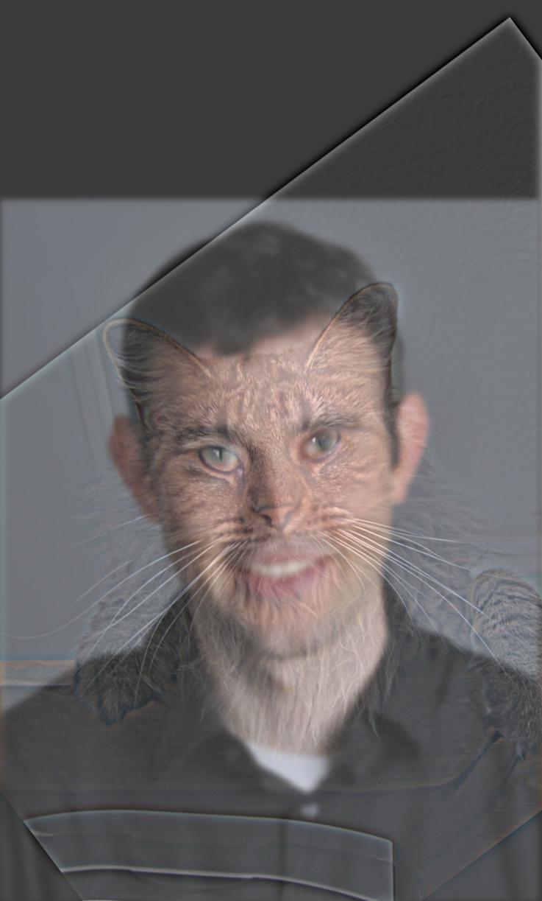

I also calculated the log magnitudes of the Fourier transform of these images:

#### FT for Derek
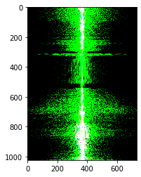

#### FT for Nutmeg

#### FT for Derek low-pass
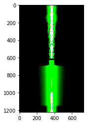

#### FT for Nutmeg high-pass
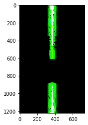

#### FT for Derek-Nutmeg hybrid
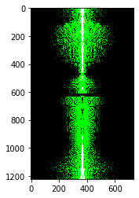

Next, I tried to make a hybrid from 2 pictures of myself, 1 when I was happy and 1 when I was sad

#### Happy Anish
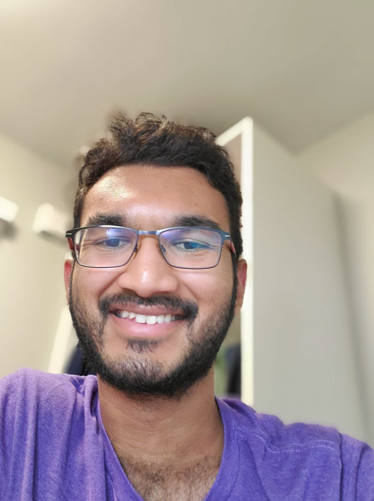

#### Sad Anish

#### Hybrid Anish Happy + Sad

This hybrid did not work very well because there was only a small but significant difference between the images, my teeth, due to which the algorithm
was unable to merge my teeth into the hybrid image without the output looking weird.

Next, I tried to make a hybrid between a young man and an old man.

#### Old man
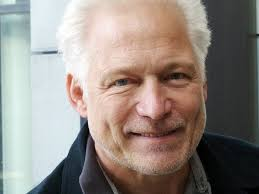

#### Young man
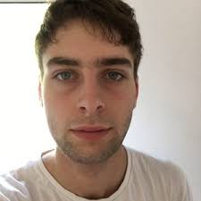

#### Hybrid old+young man
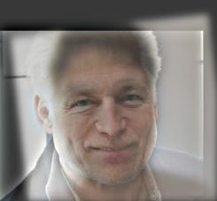

#### Bells & Whistles
I used color in all of my hybrid images above. In general, I noticed that color works better in the low-pass filters (like in Derek) because it seems to retain that color better than in the high-pass images.

### 2.3: Gaussian and Laplacian Stacks

1st image I used was the Lincoln image given as an example

#### Lincoln with Gaussian stack

#### Lincoln with Laplacian stack
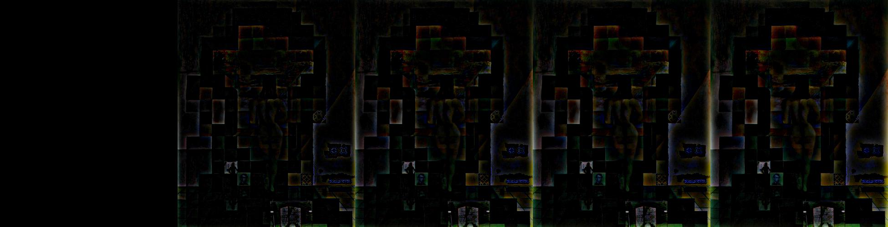

Next, I checked the Gaussian and Laplacian stacks for the hybrid image of myself.

#### Anish Hybrid with Gaussian Stack
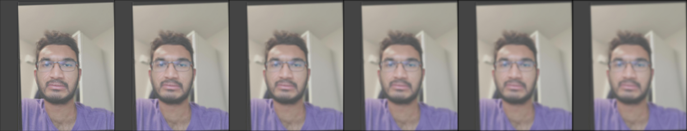

#### Anish Hybrid with Laplacian stack

The laplacian stack here is very dim with only my glasses somewhat visible. This may be because the image is a closeup, due to which there are not
a lot of edges that would show up.

### 2.4: Multiresolution blending

First, I started by making the `oraple` image by blending the apple and orange.

#### Apple

#### Orange

#### Mask

#### Oraple
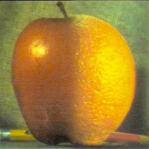

Next, I blended a picture of the moon at night with a beach during the day.

#### Moon
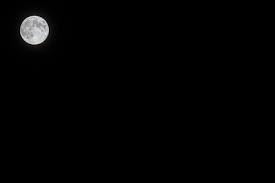

#### Beach

#### Irregular mask
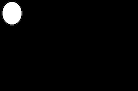

#### Moon + beach

Lastly, I blended a picture of the sun during the day with an image of water at night

#### Sun

#### Dark water

#### Irregular mask

#### Sun + water
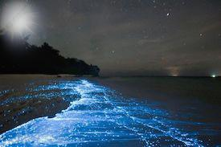

I also applied the Laplacian stack to these images

#### Sun Laplacian

#### Dark water Laplacian

#### Sun + Water Laplacian
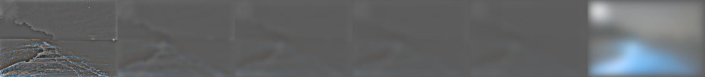

#### Bells and Whistles

I used color in all the images above to enhance the effect. In general, the color made the blended images look a lot cleaner and believable whereas grayscale images were harder to distinguish and understand.

### Coolest Thing

The coolest thing I learned was that blending requires using a mask to tell the algorithm which parts of each image you want to keep. This mask could be used to make some really cool images so I hope to have fun with this when I have more time, perhaps during winter break.